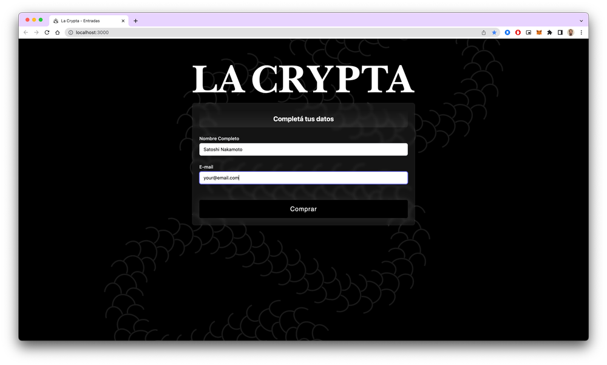

# La Crypta - Tickets

<p align="center">

</p>

## Dependencies

Install **Yarn** dependency manager

```bash
npm install --global yarn
```

Install Firebase CLI for **Firestore** and **Cloud Functions** management

```bash
curl -sL https://firebase.tools | bash
```

Install NVM to switch between **NodeJS** versions.

```bash
curl -o- https://raw.githubusercontent.com/nvm-sh/nvm/v0.39.3/install.sh | bash
```

Install Node versions **16** and **19**.

```bash
nvm install v16.14.0 # Cloud Functions
nvm install v19.3.0 # Main Next App
```

---

## Frontend Setup

Install main node modules

```bash
nvm use ## Switch Node to version 19
yarn
```

> Troubleshoot: Install the needed version with **"nvm install 19"**

Copy **.env.sample** into local **.env** file

```bash
cp .env.sample .env
```

Set your config data

```bash
NEXT_PUBLIC_HOSTNAME=http://localhost:3000 # Your host

NEXT_PUBLIC_TICKET_PRICE=2000 # Ticket price on ARS
NEXT_PUBLIC_TICKET_PRICE_PE=1000 # Ticket price on PE

NEXT_PUBLIC_LOCALHOST=1 # Enables Debug
```

Start the development server right away

```bash
yarn dev
```

Open [http://localhost:3000](http://localhost:3000) with your browser to see the result.

---

## Cloud Functions and Firestore setup

Go to functions directory

```bash
cd functions
```

Install **Cloud Functions** node modules

```bash
nvm use ## Switch Node to version 16
yarn
```

Copy **.env.sample** into local **.env** file

```bash
cp .env.sample .env
```

Set your config data

```bash
# MercadoPago
MP_SECRET_TOKEN=TEST-MP_GENERATED_TOKEN # From MercadoPago Dev SDK Dashboard
MP_NOTIFICATION_URL=https://entradas.lacrypta.com.ar/ # HTTP Webhook
MP_ORDER_NAME="La Crypta - Your Order name" # User UI label

# Email config
SMTP_HOST="Your SMTP Host"
SMTP_PORT=587
SMTP_USERNAME="Your SMTP username"
SMTP_PASSWORD="Your SMTP Password"
```

Deploy Cloud Functions

```bash
yarn deploy
```

---

## Frontend Stack

- [TailWind](https://tailwindcss.com/) - Rapidly build modern websites without ever leaving your HTML
- [RainbowKit Documentation](https://rainbowkit.com) - Learn how to customize your wallet connection flow.
- [wagmi Documentation](https://wagmi.sh) - Learn how to interact with Ethereum.
- [Next.js Documentation](https://nextjs.org/docs) - Learn how to build a Next.js application.
- [Firebase](https://firebase.google.com/docs/firestore/) - Firestore database.
